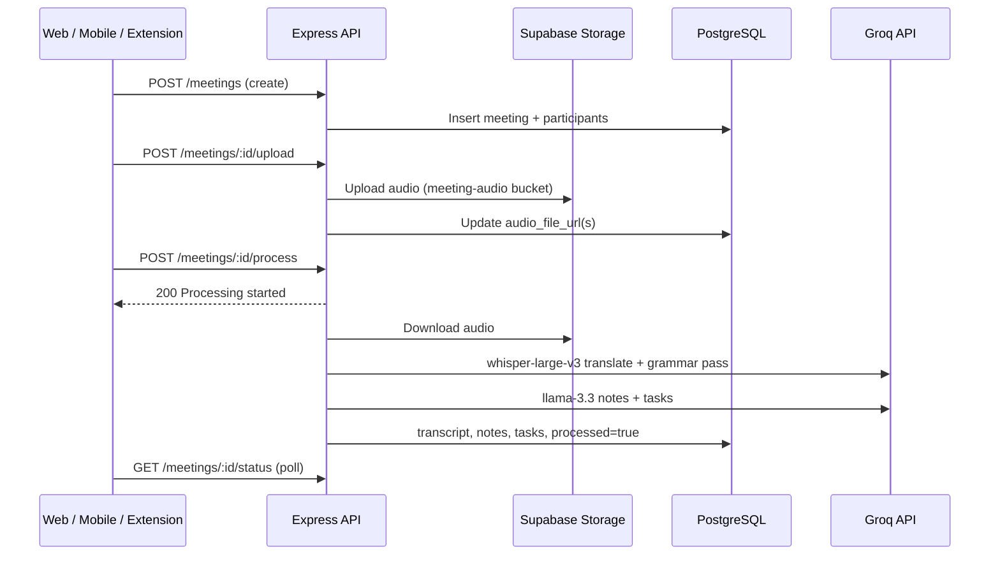

# Meeting AI — Complete Project Documentation

> A full-stack, AI-powered meeting management platform that transforms raw audio into transcripts, structured notes, action items, and an interactive Q&A assistant. Available on **web**, **mobile (Expo)**, and **Chrome extension (Google Meet)**.

---

## Table of Contents

1. [Overview](#1-overview)
2. [Repository Layout](#2-repository-layout)
3. [Core Features](#3-core-features)
4. [Meeting Types & Processing Pipeline](#4-meeting-types--processing-pipeline)
5. [Tech Stack](#5-tech-stack)
6. [Architecture](#6-architecture)
7. [Project Structure](#7-project-structure)
8. [Authentication & Security](#8-authentication--security)
9. [API Reference](#9-api-reference)
10. [Socket.io (WebRTC Signaling)](#10-socketio-webrtc-signaling)
11. [Database Schema](#11-database-schema)
12. [AI Services (Groq)](#12-ai-services-groq)
13. [Web Frontend](#13-web-frontend)
14. [Mobile App (Expo)](#14-mobile-app-expo)
15. [Chrome Extension](#15-chrome-extension)
16. [Environment Variables](#16-environment-variables)
17. [Development Setup](#17-development-setup)
18. [Deployment](#18-deployment)
19. [Known Limitations & Troubleshooting](#19-known-limitations--troubleshooting)

---

## 1. Overview

**Meeting AI** is a production-grade monorepo that automates the post-meeting workflow: record or upload audio → transcribe with Groq Whisper → summarize and extract tasks with LLaMA 3.3 → chat over meeting context.

| Resource | URL / Path |
|----------|------------|
| Live demo | https://meetingai.dev |
| Web app | `frontend/` |
| API server | `backend/` |
| Mobile app | `meeting-ai-mobile/` |
| Chrome extension | `extension/` |
| Extension docs | [extension/EXTENSION_DOCUMENTATION.md](extension/EXTENSION_DOCUMENTATION.md) |

### Value Proposition

| Capability | Implementation | Benefit |
|------------|----------------|---------|
| Real-time conferencing | WebRTC + Socket.io signaling | Peer-to-peer live audio without third-party meeting SaaS |
| Transcription | Groq `whisper-large-v3` (translation endpoint) | Fast English transcripts, including non-English source audio |
| Summarization | Groq `llama-3.3-70b-versatile` | Structured notes: summary, decisions, action items |
| Task extraction | Same LLM with participant context | Assignees inferred from conversation |
| Q&A chatbot | LLM + transcript/notes/tasks context | Ask questions about a processed meeting |
| Organizations | Supabase Auth + PostgreSQL RLS | Domain-based teams, invite codes, roles |
| Google Meet capture | Chrome extension (MV3) | One-click tab audio → same AI pipeline |

---

## 2. Repository Layout

```
meeting-ai/
├── backend/                 # Express 5 + Socket.io API
├── frontend/                # React 19 + Vite web client
├── meeting-ai-mobile/       # React Native + Expo SDK 51
├── extension/               # Chrome MV3 (Google Meet)
├── README.md
└── PROJECT_DOCUMENTATION.md # This file
```

All clients share one backend and one Supabase project.

---

## 3. Core Features

### 3.1 Authentication & Users

- Email/password signup and signin via Supabase Auth
- JWT in `Authorization: Bearer <token>` on API calls
- `GET /api/auth/me` for session validation
- User metadata: `full_name` (used in task assignment and community chat display)
- Protected routes on web (`ProtectedRoute`) and mobile (`AuthContext`)

### 3.2 Organization Management

- Create org with name, slug, email **domain**, 6-character invite code
- Join via invite code; switch active org; leave org
- Roles: `admin` | `member`
- Admin: regenerate invite, email invitations (SMTP), remove members
- Optional **Google Meet** org auto-created for extension users (`GET /api/organizations/google-meet`)

### 3.3 Meeting Management

| Type | `meetings.type` | Audio model | Task extraction |
|------|-----------------|-------------|-----------------|
| **Standard** | `standard` | One file per participant | `extractTasks()` |
| **Group** | `group` | Single shared file on meeting row | `extractGroupTasks()` (speaker inference) |
| **Live** | `live` | Recording after session ends | `extractTasks()` via `processLiveMeeting.js` |

Additional fields:

- `source` (optional): e.g. `chrome_extension`, `web` — requires [extension migration](extension/migrations/add_source_column.sql)
- `organization_id`: scopes meetings to an org
- `processed`: boolean; transcript/notes populated when true

### 3.4 Live Meetings

- 12-character `room_id` (`nanoid`)
- Status: `scheduled` → `live` → `ended`
- Socket.io: join room, WebRTC offer/answer/ICE, mute/speaking indicators
- Post-meeting: upload recording (up to 100MB) → async Groq pipeline

### 3.5 AI Chatbot (per meeting)

- Requires `processed === true` and transcript + notes present
- History stored in `chat_messages` table
- Last 10 turns sent as context to LLM

### 3.6 Community Chat (per meeting)

- Human-to-human messages in `community_messages`
- Not AI — separate from chatbot
- Access: meeting creator or participants only

### 3.7 Audio

- Web: RecordRTC + browser `getUserMedia`
- Mobile: `expo-av` via `useAudioRecorder`
- Extension: tab capture via offscreen document + `MediaRecorder` (WebM)
- Limits: **25MB** standard upload, **100MB** live/extension

---

## 4. Meeting Types & Processing Pipeline

### End-to-end flow



### Standard meeting processing

1. For each `meeting_participants` row with `audio_file_url`, download and transcribe
2. Concatenate transcripts with `\n\n`
3. `generateNotes(fullTranscript, title)`
4. `extractTasks(transcript, participants)` → insert into `tasks`
5. Update `meetings`: `transcript`, `notes`, `processed: true`

### Group meeting processing

1. Single file from `meetings.audio_file_url`
2. One transcript via Whisper
3. `extractGroupTasks()` — LLM infers speakers from one mixed recording

### Live meeting processing

Triggered when meeting ends and recording is uploaded (`processLiveMeetingAsync`):

1. Download `live_meetings.recording_url`
2. Transcribe → notes → tasks (standard extraction)
3. Update parent `meetings` row

### On failure

Meeting is still marked `processed: true` with `notes` containing error text — clients should surface this in UI.

---

## 5. Tech Stack

### Backend (`backend/package.json`)

| Package | Version | Purpose |
|---------|---------|---------|
| express | ^5.2.1 | REST API |
| socket.io | ^4.8.3 | WebRTC signaling |
| @supabase/supabase-js | ^2.89.0 | DB, auth, storage (service role) |
| groq-sdk | ^0.37.0 | Whisper + LLaMA |
| multer | ^2.0.2 | Multipart uploads |
| nanoid | ^5.1.6 | Live room IDs |
| nodemailer | ^7.0.13 | Org invite emails |
| cors, dotenv, form-data | — | CORS, env, Groq file upload |
| nodemon | ^3.1.11 (dev) | Hot reload |

### Web frontend (`frontend/package.json`)

| Package | Version | Purpose |
|---------|---------|---------|
| react / react-dom | ^19.2.0 | UI |
| vite | ^7.2.4 | Build |
| react-router-dom | ^7.11.0 | Routing |
| tailwindcss | ^3.4.19 | Styling |
| @supabase/supabase-js | ^2.89.0 | Auth client |
| axios | ^1.13.2 | HTTP |
| socket.io-client | ^4.8.3 | Live meetings |
| recordrtc | ^5.6.2 | Recording |
| framer-motion / motion | ^12.35.0 | Animations |
| three, @react-three/fiber, @react-three/drei | — | Landing 3D |
| react-markdown | ^10.1.0 | Notes rendering |
| lucide-react | ^0.562.0 | Icons |
| @shiguredo/rnnoise-wasm | ^2025.1.5 | Audio enhancement (live) |
| @daily-co/daily-js | ^0.90.0 | Present in deps (optional integrations) |

### Mobile (`meeting-ai-mobile/package.json`)

| Package | Version | Purpose |
|---------|---------|---------|
| expo | ~51.0.0 | Runtime |
| react-native | 0.74.0 | Mobile UI |
| @react-navigation/* | ^6.x | Stack + tabs |
| nativewind | ^4.0.0 | Tailwind-style classes |
| expo-av | ~14.0.0 | Audio record/playback |
| socket.io-client | ^4.7.0 | Live signaling |
| @supabase/supabase-js | ^2.39.0 | Auth |
| axios | ^1.6.0 | API |

### Chrome extension

- Manifest V3: service worker, offscreen document, content script on `meet.google.com`
- See [extension/EXTENSION_DOCUMENTATION.md](extension/EXTENSION_DOCUMENTATION.md)

---

## 6. Architecture

### System diagram

```
┌──────────────────────────────────────────────────────────────────────────┐
│  CLIENTS                                                                  │
│  ┌─────────────┐  ┌─────────────┐  ┌─────────────┐  ┌─────────────────┐ │
│  │ frontend/   │  │ meeting-ai- │  │ extension/  │  │ (Postman, etc.) │ │
│  │ React+Vite  │  │ mobile Expo │  │ Chrome MV3  │  │                 │ │
│  └──────┬──────┘  └──────┬──────┘  └──────┬──────┘  └────────┬────────┘ │
└─────────┼────────────────┼────────────────┼──────────────────┼──────────┘
          │ HTTP + WS      │ HTTP + WS      │ HTTP (chrome-ext CORS)
          ▼                ▼                ▼
┌──────────────────────────────────────────────────────────────────────────┐
│  backend/ — Express 5 + HTTP Server + Socket.io                           │
│  Routes: auth, users, meetings, chat, community-chat, live-meetings, orgs │
│  Services: groqService, storageService, email, processLiveMeeting         │
│  Sockets: signalingHandler (WebRTC)                                       │
└────────────────────────────┬─────────────────────────────────────────────┘
                             │
         ┌───────────────────┼───────────────────┐
         ▼                   ▼                   ▼
┌─────────────────┐  ┌─────────────────┐  ┌─────────────────┐
│ Supabase        │  │ Groq API        │  │ Supabase Storage │
│ PostgreSQL      │  │ Whisper + LLaMA │  │ bucket: meeting- │
│ Auth + RLS      │  │                 │  │ audio            │
└─────────────────┘  └─────────────────┘  └─────────────────┘
```

### Production URLs (configured in `server.js`)

| Service | URL |
|---------|-----|
| Frontend (custom) | https://meetingai.dev, https://www.meetingai.dev |
| Frontend (Vercel) | https://meeting-ai-psi.vercel.app |
| Backend (Render) | https://meeting-ai-3kyx.onrender.com |
| Local dev | http://localhost:5173, http://localhost:5000 |

Frontend auto-detects Render backend when hostname contains `meetingai.dev` or `vercel.app` (see `frontend/src/services/api.js`).

### CORS

- Allows listed origins, `chrome-extension://`, subdomains of `meetingai.dev`, and `vercel.app`
- Requests with **no Origin** allowed (mobile apps, Postman)
- Diagnostic: `GET /api/cors-check`

---

## 7. Project Structure

### Backend

```
backend/
├── src/
│   ├── config/
│   │   ├── groq.js
│   │   └── supabase.js          # Service role client
│   ├── middleware/
│   │   └── auth.js              # Bearer JWT → req.user
│   ├── routes/
│   │   ├── auth.js
│   │   ├── users.js
│   │   ├── meetings.js          # CRUD, upload, process, extension upload
│   │   ├── chat.js              # AI chatbot
│   │   ├── chat_community.js    # Human community chat
│   │   ├── liveMeetings.js
│   │   └── organizations.js
│   ├── services/
│   │   ├── groqService.js
│   │   ├── storageService.js
│   │   ├── email.js
│   │   └── processLiveMeeting.js
│   ├── sockets/
│   │   └── signalingHandler.js
│   └── server.js
├── package.json
├── nodemon.json
└── vercel.json                  # Not ideal for WebSockets — use Render/Railway
```

### Web frontend

```
frontend/src/
├── pages/
│   ├── LandingPage.jsx
│   ├── SignIn.jsx, SignUp.jsx
│   ├── Dashboard.jsx
│   ├── CreateMeeting.jsx, CreateGroupMeeting.jsx
│   ├── MeetingDetail.jsx
│   ├── CreateLiveMeeting.jsx, LiveMeeting.jsx
│   └── NotFound.jsx
├── components/
│   ├── Chatbot.jsx, ProtectedRoute.jsx, MobileDrawer.jsx
│   ├── OrganizationSwitcher.jsx, OrganizationPanel.jsx, OrganizationSetupModal.jsx
│   ├── OwlSplash.jsx, Seo.jsx
│   └── ui/                      # 3D, animations, FAQ, globe, etc.
├── hooks/
│   ├── useAuth.js, useWebRTC.js, useAudioRecorder.js
│   ├── useMeetingRecording.js, useMediaQuery.js, useRefetchOnFocus.js
├── contexts/
│   └── OrganizationContext.jsx
├── services/
│   ├── api.js, supabase.js
├── utils/
│   ├── meetingAudioMixer.js, audioEnhancement.js
└── App.jsx, main.jsx
```

### Mobile

```
meeting-ai-mobile/
├── App.jsx
├── src/
│   ├── screens/
│   │   ├── auth/          SignIn, SignUp
│   │   ├── dashboard/     Dashboard
│   │   ├── meetings/      Create*, MeetingDetail
│   │   ├── live/          LiveMeeting
│   │   ├── organizations/ Organization
│   │   └── profile/       Profile
│   ├── components/
│   │   ├── common/        Button, Card, Input, Toast, ...
│   │   ├── meetings/      AudioRecorder, Transcript, Notes, Tasks, ...
│   │   ├── organizations/ OrgCard, MembersList
│   │   └── chat/          ChatInterface
│   ├── navigation/        App, Auth, Main, Meeting navigators
│   ├── contexts/          AuthContext, OrganizationContext
│   ├── hooks/             useAuth, useOrganization, useAudioRecorder
│   ├── services/          api.js, supabase.js, socket.js
│   └── constants/         api.js, colors.js
├── .env.example
└── package.json
```

### Extension

```
extension/
├── manifest.json
├── background.js              # Service worker
├── offscreen.js / offscreen.html
├── content/meet.js, meet.css
├── popup/
├── lib/api.js, config.js
├── icons/
└── migrations/add_source_column.sql
```

---

## 8. Authentication & Security

### Flow

1. Client calls `POST /api/auth/signup` or `signin` with email/password
2. Backend uses Supabase Auth; returns session + JWT
3. Client stores token (localStorage web, AsyncStorage mobile)
4. All protected routes: `Authorization: Bearer <access_token>`
5. `authMiddleware` calls `supabase.auth.getUser(token)` and sets `req.user`

### Row Level Security (RLS)

Enforced in Supabase (configure in SQL editor):

- Organizations: members only
- Meetings: creator + participants
- Tasks: assignee + meeting access
- Chat: meeting participants
- Live meetings: creator + invited participants

Backend uses **service role** key — never expose it to clients. Clients use **anon** key only.

---

## 9. API Reference

Base URL: `http://localhost:5000/api` (or `VITE_API_URL` / `EXPO_PUBLIC_API_URL`)

### Authentication — `/api/auth`

| Method | Path | Auth | Description |
|--------|------|------|-------------|
| POST | `/signup` | No | `{ email, password, fullName }` |
| POST | `/signin` | No | `{ email, password }` |
| POST | `/signout` | No | Sign out |
| GET | `/me` | Bearer | Current user |

### Users — `/api/users`

| Method | Path | Auth | Description |
|--------|------|------|-------------|
| GET | `/` | Yes | List users (for participant picker) |

### Meetings — `/api/meetings`

| Method | Path | Auth | Description |
|--------|------|------|-------------|
| GET | `/` | Yes | List meetings (`?organizationId=` optional) |
| POST | `/` | Yes | Create — body: `title`, `description`, `participantIds`, `organizationId`, `type`, `source` |
| GET | `/:id` | Yes | Meeting + participants + tasks |
| POST | `/:id/upload` | Yes | Multipart `audioFiles[]` (max 10, 25MB each) |
| POST | `/:id/upload/extension` | Yes | Single `audio` WebM (100MB) — Chrome extension |
| POST | `/:id/process` | Yes | Start async AI pipeline |
| GET | `/:id/status` | Yes | `{ processed, notes, transcript, type }` |
| DELETE | `/:id` | Yes | Delete meeting |

### AI Chat — `/api/meetings` (mounted on same prefix)

| Method | Path | Auth | Description |
|--------|------|------|-------------|
| POST | `/:id/chat` | Yes | Body: `{ message }` → `{ response }` |
| GET | `/:id/chat/history` | Yes | `{ chatHistory: [...] }` |

### Community Chat — `/api/community-chat`

| Method | Path | Auth | Description |
|--------|------|------|-------------|
| GET | `/:meetingId` | Yes | `{ messages: [...] }` with user names |
| POST | `/:meetingId` | Yes | Body: `{ message }` |

### Live Meetings — `/api/live-meetings`

| Method | Path | Auth | Description |
|--------|------|------|-------------|
| POST | `/create` | Yes | Returns `meeting`, `liveMeeting`, `joinUrl`, `roomId` |
| GET | `/:id` | Yes | Live meeting + participants |
| POST | `/:id/start` | Yes | Status → `live` |
| POST | `/:id/end` | Yes | Status → `ended`, may trigger processing |
| POST | `/:id/upload-recording` | Yes | Multipart `recording` (100MB) |
| POST | `/:id/join` | Yes | Track participant join |
| POST | `/:id/leave` | Yes | Track participant leave |

### Organizations — `/api/organizations`

| Method | Path | Auth | Description |
|--------|------|------|-------------|
| POST | `/` | Yes | Create org |
| POST | `/join` | Yes | `{ inviteCode }` |
| GET | `/me` | Yes | Current active org |
| GET | `/all` | Yes | All orgs for user |
| GET | `/members` | Yes | Members list |
| POST | `/switch` | Yes | `{ organizationId }` |
| POST | `/leave` | Yes | Leave current org |
| POST | `/regenerate-invite` | Yes | Admin only |
| POST | `/invite` | Yes | Email invite (SMTP) |
| DELETE | `/members/:userId` | Yes | Admin remove member |
| GET | `/google-meet` | Yes | Get/create Google Meet org (extension) |

### Health

| Method | Path | Description |
|--------|------|-------------|
| GET | `/api/health` | Status, timestamp, email config flag |
| GET | `/api/cors-check` | Origin allow-list diagnostic |

---

## 10. Socket.io (WebRTC Signaling)

Connect to same host as API (no `/api` path), e.g. `http://localhost:5000`.

### Client → Server events

| Event | Payload | Description |
|-------|---------|-------------|
| `join-room` | `{ roomId, userId, userName }` | Join live room |
| `offer` | `{ offer, to }` | WebRTC offer to peer socket id |
| `answer` | `{ answer, to }` | WebRTC answer |
| `ice-candidate` | `{ candidate, to }` | ICE candidate |
| `mute` / `unmute` | — | Broadcast mute state |
| `speaking` | `{ isSpeaking }` | Speaking indicator |
| `leave-room` | — | Leave room |

### Server → Client events

| Event | Description |
|-------|-------------|
| `user-joined` | New peer in room |
| `room-participants` | Existing peers (on join) |
| `offer` / `answer` / `ice-candidate` | Forwarded signaling |
| `user-muted` / `user-unmuted` | Peer audio state |
| `user-speaking` | Peer speaking state |
| `user-left` | Peer disconnected |

Implementation: `backend/src/sockets/signalingHandler.js`  
Web client hook: `frontend/src/hooks/useWebRTC.js`  
Mobile: `meeting-ai-mobile/src/services/socket.js`

---

## 11. Database Schema

> Table names match **actual code** in `backend/src/routes`. Apply policies in Supabase SQL editor. Optional `source` column: [extension/migrations/add_source_column.sql](extension/migrations/add_source_column.sql).

### `organizations`

| Column | Type | Description |
|--------|------|-------------|
| id | uuid | PK |
| name | text | Display name |
| slug | text | URL slug |
| domain | text | Email domain for auto-join |
| invite_code | text | 6-char code |
| created_by | uuid | Creator |
| created_at | timestamptz | |

### `organization_members`

| Column | Type | Description |
|--------|------|-------------|
| id | uuid | PK |
| organization_id | uuid | FK |
| user_id | uuid | FK auth.users |
| role | text | `admin` \| `member` |
| joined_at | timestamptz | |

### `meetings`

| Column | Type | Description |
|--------|------|-------------|
| id | uuid | PK |
| title | text | |
| description | text | |
| created_by | uuid | |
| organization_id | uuid | Nullable |
| type | text | `standard` \| `group` \| `live` |
| source | text | Optional: `chrome_extension`, `web`, … |
| transcript | text | After processing |
| notes | text | LLM-generated |
| audio_file_url | text | Group/live single file path |
| processed | boolean | |
| created_at | timestamptz | |

### `meeting_participants`

| Column | Type | Description |
|--------|------|-------------|
| id | uuid | PK |
| meeting_id | uuid | FK |
| user_id | uuid | |
| audio_file_url | text | Per-participant upload (standard) |

### `tasks`

| Column | Type | Description |
|--------|------|-------------|
| id | uuid | PK |
| meeting_id | uuid | FK |
| title | text | |
| assignee_id | uuid | Nullable |
| completed | boolean | |
| created_at | timestamptz | |

### `chat_messages` (AI chatbot history)

| Column | Type | Description |
|--------|------|-------------|
| id | uuid | PK |
| meeting_id | uuid | FK |
| user_id | uuid | |
| message | text | User question |
| response | text | AI answer |
| created_at | timestamptz | |

### `community_messages` (human chat)

| Column | Type | Description |
|--------|------|-------------|
| id | uuid | PK |
| meeting_id | uuid | FK |
| user_id | uuid | |
| message | text | |
| created_at | timestamptz | |

### `live_meetings`

| Column | Type | Description |
|--------|------|-------------|
| id | uuid | PK |
| meeting_id | uuid | FK meetings |
| room_id | text | 12-char nanoid |
| status | text | `scheduled` \| `live` \| `ended` |
| started_at | timestamptz | |
| ended_at | timestamptz | |
| recording_url | text | Storage path after upload |

### `live_participants`

| Column | Type | Description |
|--------|------|-------------|
| id | uuid | PK |
| live_meeting_id | uuid | FK |
| user_id | uuid | |
| is_bot | boolean | AI bot participant |
| is_connected | boolean | |
| joined_at | timestamptz | |
| left_at | timestamptz | |

### `meeting_recordings` (optional / live)

| Column | Type | Description |
|--------|------|-------------|
| id | uuid | PK |
| live_meeting_id | uuid | FK |
| file_url | text | |
| file_size | integer | Bytes |

### Storage

- Bucket: **`meeting-audio`** (public or signed URLs per your policy)
- Paths managed by `storageService.js`

---

## 12. AI Services (Groq)

File: `backend/src/services/groqService.js`

| Function | Model | Purpose |
|----------|-------|---------|
| `transcribeAudio(buffer, fileName)` | `whisper-large-v3` | Translation endpoint → English; then `correctSentences()` via LLaMA |
| `generateNotes(transcript, title)` | `llama-3.3-70b-versatile` | Sections: Summary, Key Points, Decisions, Action Items, Next Steps |
| `extractTasks(transcript, participants)` | `llama-3.3-70b-versatile` | JSON array `{ title, assigneeId }` |
| `extractGroupTasks(...)` | Same | Speaker inference from single track |
| `chatWithContext(message, context, history)` | Same | Q&A with transcript/notes/tasks; last 10 turns |

Temp files written to `backend/temp/` during transcription and deleted after use.

---

## 13. Web Frontend

### Routes (`App.jsx`)

| Route | Page | Protected |
|-------|------|-----------|
| `/` | LandingPage | No |
| `/signin`, `/signup` | Auth | No |
| `/dashboard` | Dashboard | Yes |
| `/create-meeting` | CreateMeeting | Yes |
| `/create-group-meeting` | CreateGroupMeeting | Yes |
| `/meetings/:id` | MeetingDetail | Yes |
| `/create-live-meeting` | CreateLiveMeeting | Yes |
| `/live-meeting/:id` | LiveMeeting | Yes |
| `*` | NotFound | No |

### Key components

| Component | Role |
|-----------|------|
| Chatbot.jsx | Meeting Q&A UI |
| OrganizationContext | Active org, switch, fetch orgs |
| useWebRTC | Socket + RTCPeerConnection for live room |
| useAudioRecorder / useMeetingRecording | Capture & upload |
| meetingAudioMixer.js, audioEnhancement.js | Live audio processing |
| ui/* | Marketing 3D, FAQ, scroll animations |

### Env

```env
VITE_SUPABASE_URL=
VITE_SUPABASE_ANON_KEY=
VITE_API_URL=http://localhost:5000/api
VITE_SOCKET_URL=http://localhost:5000   # optional; auto-detect in prod
```

---

## 14. Mobile App (Expo)

React Native client with feature parity to core web flows.

### Setup

```bash
cd meeting-ai-mobile
npm install
cp .env.example .env
# Set EXPO_PUBLIC_SUPABASE_URL, EXPO_PUBLIC_SUPABASE_ANON_KEY, EXPO_PUBLIC_API_URL
npx expo start
```

### Environment

```env
EXPO_PUBLIC_SUPABASE_URL=your_supabase_project_url
EXPO_PUBLIC_SUPABASE_ANON_KEY=your_supabase_anon_key
EXPO_PUBLIC_API_URL=https://your_backend_host/api
```

`SOCKET_URL` is derived by stripping `/api` from API URL (`src/constants/api.js`).

### Navigation

- **Unauthenticated**: `AuthNavigator` → SignIn, SignUp
- **Authenticated**: `MainNavigator` (bottom tabs)
  - **Dashboard** stack: home, meeting detail, create meeting/group/live, live room (modal)
  - **Meetings** stack: `MeetingNavigator`
  - **Organizations**: org screen
  - **Profile**: user profile

### Contexts & services

| Module | Purpose |
|--------|---------|
| AuthContext | Session, token in AsyncStorage |
| OrganizationContext | Multi-org state |
| api.js | Axios + interceptors |
| socket.js | Socket.io for live meetings |
| useAudioRecorder | expo-av recording |

### Build (EAS)

```bash
npm run build:android
npm run build:ios
```

Requires Expo EAS configuration.

---

## 15. Chrome Extension

| Item | Detail |
|------|--------|
| Docs | [extension/README.md](extension/README.md), [extension/EXTENSION_DOCUMENTATION.md](extension/EXTENSION_DOCUMENTATION.md) |
| Load | `chrome://extensions` → Developer mode → Load unpacked → `extension/` |
| Record | Injected button on Google Meet → tab audio → WebM upload |
| Org | Auto `Google Meet` organization per user |
| API | `GET /api/organizations/google-meet`, `POST /api/meetings/:id/upload/extension` |
| Meeting type | Created as `group` with `source: chrome_extension` |

**Why offscreen document?** MV3 cannot call `tabCapture.capture()` in the service worker; uses `getMediaStreamId` + offscreen `getUserMedia`.

---

## 16. Environment Variables

### Backend (`backend/.env`)

```env
PORT=5000
SUPABASE_URL=
SUPABASE_SERVICE_KEY=          # Service role — server only
GROQ_API_KEY=
FRONTEND_URL=http://localhost:5173

# Optional SMTP (org invites)
SMTP_HOST=
SMTP_PORT=587
SMTP_USER=
SMTP_PASS=
AI_BOT_EMAIL=ai-bot@meetai.internal
```

### Web (`frontend/.env`)

```env
VITE_SUPABASE_URL=
VITE_SUPABASE_ANON_KEY=
VITE_API_URL=http://localhost:5000/api
VITE_SOCKET_URL=http://localhost:5000
```

### Mobile (`meeting-ai-mobile/.env`)

```env
EXPO_PUBLIC_SUPABASE_URL=
EXPO_PUBLIC_SUPABASE_ANON_KEY=
EXPO_PUBLIC_API_URL=http://localhost:5000/api
```

---

## 17. Development Setup

### Prerequisites

- Node.js 18+ recommended
- Supabase project (Auth + DB + Storage)
- Groq API key
- For live meetings locally: backend must run with Socket.io (not serverless)

### Install all packages

```bash
cd backend && npm install
cd ../frontend && npm install
cd ../meeting-ai-mobile && npm install
```

### Run locally

```bash
# Terminal 1 — API + WebSockets
cd backend && npm run dev

# Terminal 2 — Web
cd frontend && npm run dev

# Terminal 3 — Mobile (optional)
cd meeting-ai-mobile && npx expo start
```

- Web: http://localhost:5173  
- API: http://localhost:5000  
- Health: http://localhost:5000/api/health  

### Supabase checklist

1. Create project and enable Email auth  
2. Create tables (see [Database Schema](#11-database-schema)) with RLS  
3. Create storage bucket **`meeting-audio`**  
4. Run optional `extension/migrations/add_source_column.sql` for extension tagging  
5. Copy URL, anon key, service role key into env files  

---

## 18. Deployment

| Component | Recommended | Notes |
|-----------|-------------|-------|
| Frontend | Vercel / Netlify | `npm run build` → `dist/` |
| Backend | **Render**, Railway, VPS | **Required** for Socket.io / live meetings |
| Database | Supabase hosted | Auth + Postgres + Storage |
| Mobile | Expo EAS | Store builds |
| Extension | Chrome Web Store | Zip `extension/` or developer load |

**Do not** deploy the Express+Socket.io server to Vercel serverless for live meeting features — WebSockets need a persistent process.

### Backend scripts

```bash
npm run dev    # nodemon
npm start      # production node
```

### Frontend scripts

```bash
npm run dev
npm run build
npm run preview
```

---

## 19. Known Limitations & Troubleshooting

| Issue | Cause | Mitigation |
|-------|-------|------------|
| Live meeting won't connect | Backend on serverless / wrong `VITE_SOCKET_URL` | Deploy backend to Render; set socket URL |
| CORS errors | Origin not in allow list | Check `/api/cors-check`; add `FRONTEND_URL` |
| Chatbot 400 | Meeting not processed | Wait for `processed: true` and poll `/status` |
| Extension upload fails | File > 100MB or wrong MIME | Re-record shorter meeting; WebM only |
| `source` column error | Migration not applied | Run `add_source_column.sql` or omit `source` in create |
| Email invites don't send | SMTP not configured | `/api/health` shows `email: not_configured` |
| Processing notes show error | Groq/Whisper failure | Check `GROQ_API_KEY`, audio format, logs in backend |

### Supported audio formats

MP3, WAV, M4A, OGG, WebM (live/extension often WebM)

### Browser / device support

- Web live meetings: modern browser with `getUserMedia` + WebRTC  
- Mobile: microphone permissions via `expo-av` / permissions helper  

---

## License

MIT License — see [README.md](README.md).

---

*Last updated to reflect monorepo layout including `meeting-ai-mobile`, corrected table names (`chat_messages`, `community_messages`), community chat API, extension routes, and Groq pipeline details.*
